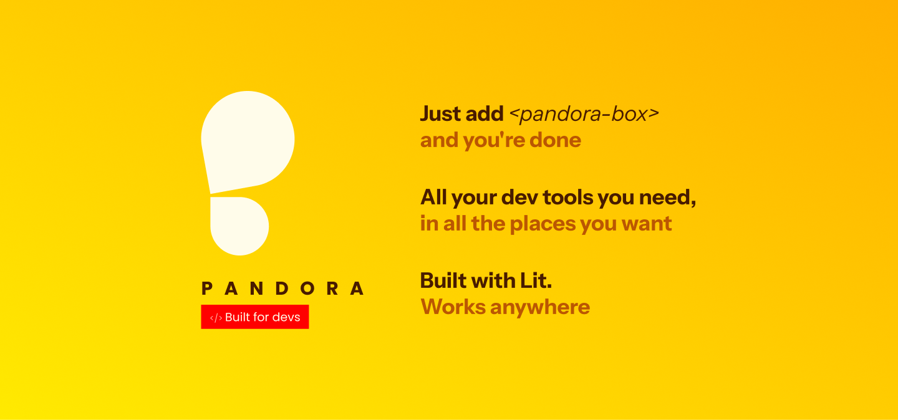

Pandora – Own the box, own the chaos

**Pandora** is a lightweight, extensible floating dev panel that sticks to the bottom of your screen and gives you quick access to the tools you wish your framework shipped with.

Built with [Lit](https://lit.dev/), Pandora is incredibly easy to extend—even with minimal developer experience. Add links, utilities, launchers, notes, music controls, and more. If it helps you build faster, it belongs in Pandora.

## 🧠 Why Pandora?

Framework dev bars are great—until you want to customize them. Astro and Next.js give you a dev bar but keep it locked.

> We wanted to open the box. So we built **Pandora**—an open, extendable dev toolbelt that *you* control.

## 🔧 Features
- 🧰 Floating panel that’s always within reach
- 🧱 Built with Lit Web Components – extend with ease
- 🧩 Add launchers, sticky notes, music, shortcuts & more
- ✨ Bring your own tools or use our premade ones
- 🎯 Works with any stack – not just frameworks with built-in dev bars
- 🔓 Fully customizable with minimal setup

## 🚀 Get Started
### 1. Add the Pandora component to your dev environment.
#### ✅ Use via CDN (no build step)

```html
<!-- Load Pandora -->
<script type="module" src="https://cdn.madeofzero.tech/raw/pandora-box@0.0.3.js"></script>

<!-- Load Plugins -->
<script type="module" src="https://cdn.madeofzero.tech/raw/pandora-core-plugins@0.0.3.js"></script>

<!-- Use the Pandora box -->
<pandora-box
  theme="light"
  position="bottom-right"
></pandora-box>
```

**Note**: Pandora will **auto-register** plugins that are imported. You don’t need to call `registerPlugin` manually.


#### 📦 Use via NPM (React, Vite, Next.js, Astro, etc.)
> Coming soon

---

Made with ❤️ by devs who wanted more from their dev bars.
